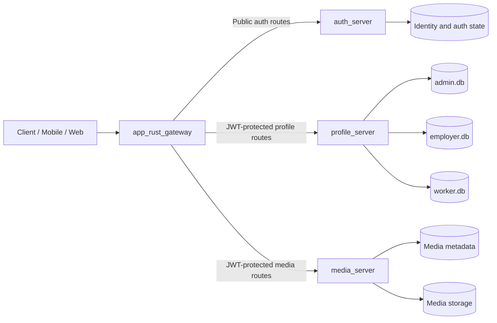
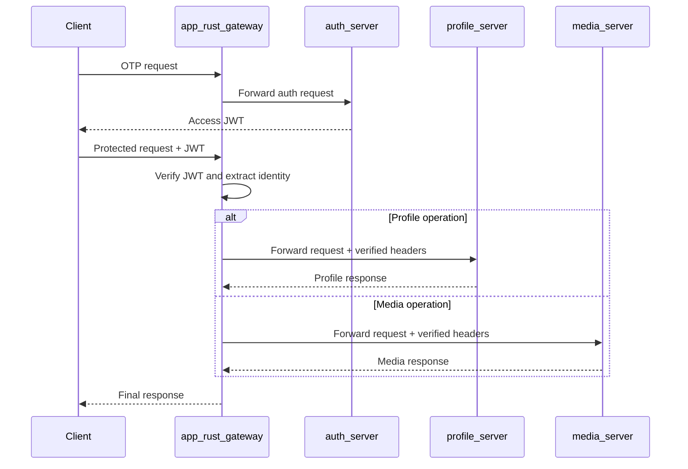

# CoopGrid Backend ⚙️

**Theme:** Agriculture, FoodTech & Rural Development
**Organization:** Ministry of Cooperation (NCCT)

## Overview

CoopGrid is a modular backend platform that provides authentication, profile
management, and media storage for Labour Cooperative Federations. The backend is
organized into independent domain services so that each service has a clear
responsibility and can be developed and scaled independently.

The backend includes the following four core services:

| Service | Responsibility | Technology |
| --- | --- | --- |
| [`app_rust_gateway`](./app_rust_gateway) | Entry point for client requests, routing, and JWT verification | Rust, Axum |
| [`auth_server`](./auth_server) | OTP-based authentication and access-token issuance | Rust, Axum, Bincode |
| [`media_server`](./media_server) | Media upload, metadata storage, and streaming | Rust, Axum, Bincode, SQLite WAL |
| [`profile_server`](./profile_server) | Admin, Employer, and Worker profile management | Python, FastAPI, SQLite |

## Backend Architecture



`app_rust_gateway` serves as the boundary between clients and internal
services. Except for authentication routes, the gateway verifies the access
token for profile and media requests and forwards the verified user context to
the appropriate downstream service.

## Services

### 1. `app_rust_gateway`

This asynchronous Rust API gateway is the single entry point for the backend.

- `/health` is a public route for gateway health checks.
- `/auth/*` and `/uvw/*` are forwarded to the authentication service.
- JWT verification is required for `/profile/*` requests.
- JWT verification is required for `/media/*` requests.
- The user ID and role from a valid token are forwarded to downstream services
  through the `X-User-ID` and `X-User-Role` headers.
- The gateway removes the service prefix before forwarding a request. For
  example, `/profile/me` is forwarded to the profile service as `/me`.

### 2. `auth_server`

This service manages user identity and the login flow.

- Employer OTP send and verification endpoints are available.
- An access token is issued after successful OTP verification.
- A private key is used to sign JWTs, and a public key is used for token
  verification.
- Authentication data, including identity and authentication state, is persisted
  in Bincode-serialized binary storage rather than a text-based format.
- Bincode provides compact storage and efficient serialization/deserialization,
  which helps keep authentication reads and writes lightweight.
- The `/health` endpoint is available for service health checks.
- Worker and Admin authentication routes can be added using the same role-based
  structure.

### 3. `media_server`

This is a Rust-based media vault microservice.

- `POST /api/v1/media/upload` uploads media files.
- `GET /api/v1/media/stream/:media_id` streams stored media.
- Media file content is stored using Bincode-based binary storage.
- Media metadata is stored in SQLite with Write-Ahead Logging (WAL) enabled.
- Keeping binary content separate from metadata allows efficient file
  persistence while SQLite provides structured lookup and metadata management.
- Bincode keeps media storage compact and fast to serialize, while SQLite WAL
  improves read/write concurrency, allows readers to continue during writes,
  and provides reliable transaction recovery.
- The `/health` endpoint is available for service health checks.
- Asynchronous and streaming I/O are used for large files.

### 4. `profile_server`

This FastAPI-based domain service manages user profiles. Instead of duplicating
authentication logic, it relies on the verified identity context received from
the gateway.

- Separate profile domains are provided for Admin, Employer, and Worker users.
- Each domain uses a separate SQLite database:
  `data/admin.db`, `data/employer.db`, and `data/worker.db`.
- Asynchronous database access keeps profile read and update operations
  non-blocking.
- Profile information can include personal details, company details, skills,
  verification documents, and settings.
- The service initializes all three databases and the required tables at
  startup.

## Request Flow

### Authentication Flow

1. The client sends an authentication request to the gateway.
2. The gateway forwards the request to `auth_server`.
3. `auth_server` generates and sends an OTP.
4. The client submits the OTP, and `auth_server` verifies it.
5. After successful verification, `auth_server` issues a signed JWT access
   token.
6. The client sends this token in the `Authorization: Bearer <token>` header
   for subsequent requests.

### Protected Profile or Media Flow

1. The client sends a request to `/profile/*` or `/media/*` with a JWT.
2. The gateway verifies the JWT signature, expiry, and claims.
3. The gateway adds the verified identity to the `X-User-ID` and
   `X-User-Role` headers.
4. The request is forwarded to the appropriate internal service.
5. `profile_server` selects the profile database based on the user domain,
   while `media_server` operates on media metadata and content.
6. The response is returned to the client through the gateway.



## Service Ports

| Service | Default URL |
| --- | --- |
| `app_rust_gateway` | `http://127.0.0.1:8001` |
| `auth_server` | `http://127.0.0.1:8002` |
| `media_server` | `http://127.0.0.1:8003` |
| `profile_server` | `http://127.0.0.1:8004` |

## Local Development

For Rust services:

```bash
cd backend/<service-directory>
cargo run
```

For the profile service:

```bash
cd backend/profile_server
python -m venv venv
# Windows
venv\Scripts\activate
pip install -r requirements.txt
uvicorn app.main:app --host 0.0.0.0 --port 8004 --reload
```

Configure the gateway with the URLs of the auth, media, and profile services,
as well as the JWT public key path. In production, provide secrets and signing
keys through environment variables or a secure secret manager.

## Detailed Documentation

- [`app_rust_gateway/README.md`](./app_rust_gateway/README.md)
- [`profile_server/README.md`](./profile_server/README.md)
- [`profile_server/docs/`](./profile_server/docs/)
- [`media_server/TESTING.md`](./media_server/TESTING.md)
