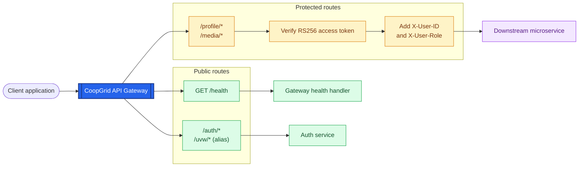

# CoopGrid API Gateway

CoopGrid API Gateway is an asynchronous reverse proxy built with **Rust**, **Axum**,
and **Tower**. It is the single entry point for client requests and is responsible
for routing, JWT authentication, request logging, health checks, and forwarding
requests to downstream microservices.

## Documentation

Detailed documentation is maintained in the [`docs/`](./docs/) directory:

- [Architecture](./docs/architecture.md) - gateway components and request flow
- [Configuration](./docs/config.md) - environment variables and service URLs
- [Health checks](./docs/health.md) - gateway and downstream health monitoring
- [Middleware](./docs/middlewares.md) - JWT verification, logging, and rate limiting
- [Proxy](./docs/proxy.md) - request forwarding and route mapping
- [Utilities](./docs/utils.md) - shared errors and helper modules

When adding or updating gateway behavior, update the related document in
[`docs/`](./docs/) as part of the same change.

## Request flow



The gateway first classifies each request. Health and authentication requests use
the public path and are forwarded without JWT verification. Profile and media
requests use the protected path, where the gateway verifies the RS256 access
token, adds the authenticated user context, and then forwards the request to the
appropriate downstream service.

## Route mapping

| Gateway route | Authentication | Downstream service |
| --- | --- | --- |
| `/health` | Public | Gateway health handler |
| `/auth` and `/auth/*` | Public | Auth service |
| `/uvw` and `/uvw/*` | Public | Auth service (alias) |
| `/profile` and `/profile/*` | JWT required | Profile service |
| `/media/*` | JWT required | Media service |

The gateway strips the service prefix before forwarding a request. For example,
`/profile/me` is forwarded to the profile service as `/me`.

## Configuration

Configuration is loaded from environment variables and an optional `.env` file.
The following defaults are used when variables are not set:

| Variable | Default |
| --- | --- |
| `GATEWAY_PORT` | `8001` |
| `AUTH_SERVICE_URL` | `http://127.0.0.1:8002` |
| `MEDIA_SERVICE_URL` | `http://127.0.0.1:8003` |
| `PROFILE_SERVICE_URL` | `http://127.0.0.1:8004` |
| `JWT_PUBLIC_KEY_PATH` | `./certs/jwt_public.pem` |

The file configured by `JWT_PUBLIC_KEY_PATH` must contain a valid RSA public key
in PEM format.

## Getting started

From this directory:

```bash
cargo run
```

The gateway listens on `http://localhost:8001` by default.

## Testing

Run the Rust test suite with:

```bash
cargo test
```

The tests cover public routes, JWT-protected routes, token validation, header
enrichment, and health checks.

## Project structure

```text
app_rust_gateway/
├── certs/       # JWT public key
├── docs/        # Detailed gateway documentation
├── src/         # Gateway implementation
├── tests/       # Integration tests
└── Cargo.toml   # Rust package and dependency configuration
```
