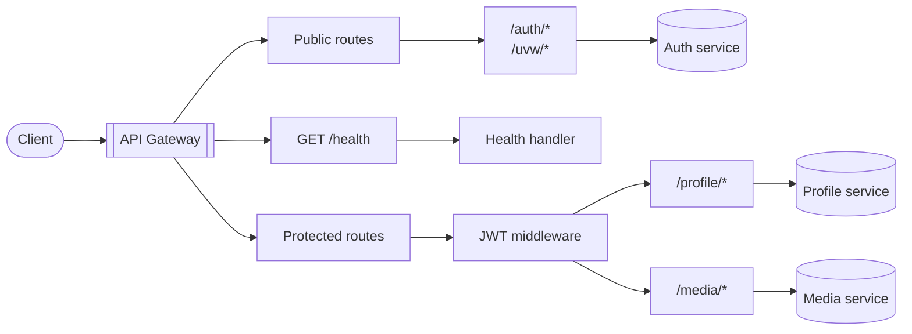

# CoopGrid API Gateway Architecture

## Overview

The CoopGrid API Gateway is the single entry point between client applications
and downstream microservices. It is built with Rust, Axum, Tokio, Reqwest, and
Tower.

Its main responsibilities are:

- Route requests to the correct downstream service.
- Keep public and protected routes separate.
- Apply authentication to protected routes.
- Forward requests and return downstream responses.
- Provide health status and structured error responses.

## Request flow



Public routes are forwarded without JWT authentication. Protected routes pass
through the JWT middleware before reaching the profile or media service.

## Main components

```text
src/
├── main.rs              # Application startup and server binding
├── config.rs            # Shared application configuration
├── health/              # Health endpoint and service monitoring
├── middlewares/         # Request authentication middleware
├── proxy/               # Route definitions and request forwarding
└── utils/               # Shared error handling
```

### Component responsibilities

| Component | Responsibility |
| --- | --- |
| `config` | Loads service URLs, gateway port, and JWT public key |
| `health` | Reports gateway and downstream service health |
| `middlewares` | Validates JWTs for protected routes |
| `proxy` | Rewrites paths and forwards HTTP requests |
| `utils` | Provides a consistent JSON error response |

Detailed behavior for each component is documented separately in the
corresponding files below.

## Route boundaries

| Route | Access | Destination |
| --- | --- | --- |
| `/health` | Public | Gateway health handler |
| `/auth` and `/auth/*` | Public | Auth service |
| `/uvw` and `/uvw/*` | Public alias | Auth service |
| `/profile` and `/profile/*` | JWT required | Profile service |
| `/media/*` | JWT required | Media service |
| Any other route | Public fallback | `404 Not Found` |

## Related documentation

- [Configuration](./config.md)
- [Health checks](./health.md)
- [Middleware](./middlewares.md)
- [Proxy](./proxy.md)
- [Utilities](./utils.md)
