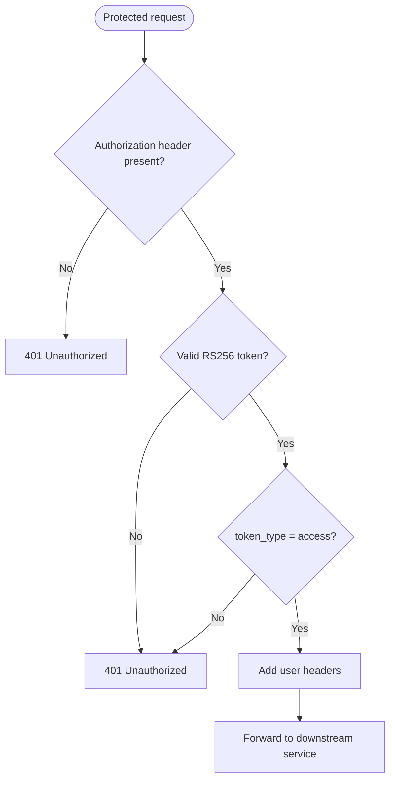

# Middleware

The gateway currently uses JWT authentication middleware for protected routes.
The middleware is implemented in `src/middlewares/auth_interceptor.rs` and is
attached only to the profile and media route tree.

## Route protection

| Route group | JWT middleware |
| --- | --- |
| `/health` | Not applied |
| `/auth` and `/auth/*` | Not applied |
| `/uvw` and `/uvw/*` | Not applied |
| `/profile` and `/profile/*` | Applied |
| `/media/*` | Applied |

Public routes can be used without an access token. Every request to a protected
route must pass JWT validation before it is forwarded.

## Authentication flow

For a protected request, the middleware:

1. Reads the `Authorization` header.
2. Requires the standard authorization scheme with a token.
3. Verifies the token signature with the configured RSA public key.
4. Allows only the `RS256` algorithm.
5. Validates the `exp` expiration claim.
6. Requires `token_type` to be `access`.
7. Adds the authenticated user context to the request.
8. Passes the enriched request to the proxy handler.

## JWT claims

The middleware reads these claims:

| Claim | Purpose |
| --- | --- |
| `sub` | User identifier |
| `exp` | Token expiration time |
| `token_type` | Access-token guard; must be `access` |
| `role` | Optional user role |

The RSA public key is loaded during application startup from
`JWT_PUBLIC_KEY_PATH`. The private signing key is not required by the gateway.

## Request enrichment

After successful validation, the middleware adds:

- `X-User-ID` from the `sub` claim.
- `X-User-Role` from the `role` claim, when a role is present.

These headers allow downstream services to use the verified identity without
decoding the JWT again. Downstream services should treat these headers as
gateway-generated trusted context and should not expose them directly to
untrusted clients.

## Authentication errors

Authentication failures are returned using the gateway's standard JSON error
format and are not forwarded downstream.

| Condition | HTTP status | Error code |
| --- | --- | --- |
| Missing or malformed `Authorization` header | `401` | `MISSING_AUTHORIZATION_HEADER` |
| Invalid signature or malformed token | `401` | `INVALID_JWT_TOKEN` |
| Expired token | `401` | `TOKEN_EXPIRED` |
| Refresh or other non-access token | `401` | `INVALID_JWT_TOKEN` |

Failed authentication attempts are recorded through the structured
`gateway_auth` logs. Successful verification also records the request path and
authenticated user context.

## Related documentation

- [Architecture](./architecture.md)
- [Configuration](./config.md)
- [Proxy](./proxy.md)
- [Utilities](./utils.md)
